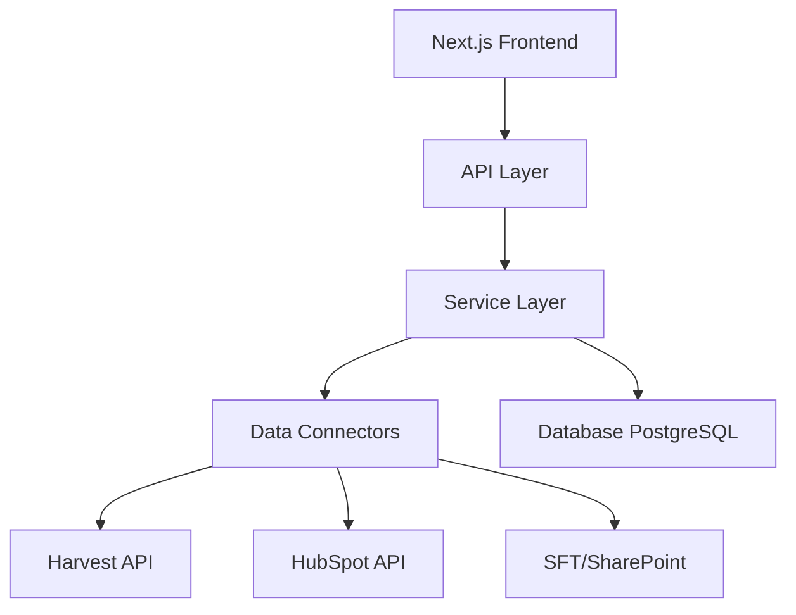

# 🤖 Codex/AI Assistant Codebase Guide

## Project Overview
**Name**: MoA Account Manager AI (AM Copilot)  
**Purpose**: AI-powered profitability and billing management system for Map of Ag  
**Tech Stack**: Next.js, TypeScript, PostgreSQL, Node.js, Vercel  
**Repository**: https://github.com/17871787/Account_Manager_Tool  
**Live URL**: https://am-copilot.vercel.app

## 🏗️ Architecture Overview



## 📁 Directory Structure

```
Account_Manager_Tool/
├── app/                    # Next.js 13+ App Router
│   ├── layout.tsx         # Root layout with Radix UI Theme
│   ├── page.tsx           # Main dashboard component
│   └── globals.css        # Global styles with Tailwind
│
├── src/
│   ├── api/
│   │   └── routes.ts      # Express API routes
│   │
│   ├── connectors/        # External API integrations
│   │   ├── harvest.connector.ts    # Harvest time tracking
│   │   ├── hubspot.connector.ts    # HubSpot CRM
│   │   └── sft.connector.ts        # Sales Forecast Tracker
│   │
│   ├── services/          # Business logic
│   │   ├── profitability.service.ts  # Margin calculations
│   │   └── export.service.ts         # Invoice generation
│   │
│   ├── rules/             # Business rules engine
│   │   └── exception.engine.ts       # Exception detection
│   │
│   ├── models/            # Database layer
│   │   └── database.ts    # PostgreSQL connection
│   │
│   └── types/             # TypeScript definitions
│       └── index.ts       # All type interfaces
│
├── api/                   # Vercel serverless functions
│   └── index.ts          # Main API handler
│
├── scripts/
│   ├── schema.sql        # Database schema
│   └── migrate.ts        # Migration runner
│
└── Configuration Files
    ├── next.config.js    # Next.js configuration
    ├── tailwind.config.js # Tailwind CSS
    ├── jest.config.js    # Testing configuration
    ├── lighthouserc.js   # Performance testing
    └── sonar-project.properties # Code quality

```

## 🔑 Key Components

### Frontend Components (`app/page.tsx`)
```typescript
// Main dashboard with:
- Profitability charts (Recharts)
- Exception management interface
- Budget tracking visualizations
- Sync buttons for Harvest/HubSpot/SFT
- Export functionality
```

### API Endpoints (`src/api/routes.ts`)
```typescript
POST /api/sync/harvest     # Sync time entries
POST /api/sync/hubspot     # Sync CRM data
POST /api/sync/sft         # Sync revenue data
POST /api/profitability/calculate  # Calculate margins
GET  /api/exceptions/pending       # Get exceptions
POST /api/export/invoice          # Generate invoices
GET  /api/budget/:projectId      # Budget vs burn
```

### Data Models (`src/types/index.ts`)
```typescript
interface HarvestTimeEntry {
  entryId, date, client, project, task, hours,
  billableFlag, costRate, billableRate, ...
}

interface ProfitabilityMetric {
  month, client, project, billableCost,
  exclusionCost, recognisedRevenue, margin, ...
}

interface Exception {
  id, type, severity, description,
  suggestedAction, status, ...
}
```

## 🔄 Data Flow

### 1. **Sync Flow**
```
User clicks "Sync Harvest" → API call → HarvestConnector
→ Fetch time entries → Store in PostgreSQL → Update UI
```

### 2. **Profitability Calculation**
```
Q-Review Formula: Margin = Revenue - (Billable Cost + Exclusion Cost)
- Billable Cost: Time marked as billable × cost rate
- Exclusion Cost: Non-billable but tracked (e.g., data ingestion)
- Revenue: From SFT/HubSpot integration
```

### 3. **Exception Detection Rules**
```typescript
// Automatic detection of:
- Rate mismatches (expected vs actual)
- Budget breaches (>90% utilization)
- Billable conflicts (task category mismatch)
- Deprecated task usage
- Missing rates
```

## 🗄️ Database Schema

### Core Tables
- `clients` - Customer organizations
- `projects` - Customer projects
- `tasks` - Task taxonomy (billable/exclusion/non-billable)
- `time_entries` - Harvest time data
- `sft_revenue` - Recognized revenue
- `profitability_metrics` - Calculated margins
- `exceptions` - Detected anomalies
- `users` - System users with roles

## 🔐 Environment Variables

```bash
# Database
DATABASE_URL=postgresql://...

# External APIs
HARVEST_ACCOUNT_ID=xxx
HARVEST_ACCESS_TOKEN=xxx
HUBSPOT_API_KEY=xxx
MS_TENANT_ID=xxx        # For SFT/SharePoint
MS_CLIENT_ID=xxx
MS_CLIENT_SECRET=xxx

# Deployment
VERCEL_TOKEN=xxx
```

## 🧪 Testing Strategy

### Unit Tests (`jest`)
- Location: `src/**/__tests__/`
- Coverage requirement: 80%
- Run: `npm test`

### Integration Tests
- Lighthouse CI: Performance >85%
- Accessibility: >90%
- Best Practices: >90%

### Code Quality (SonarCloud)
- Security hotspots: 0
- Code duplication: <3%
- Maintainability: Grade A

## 🚀 CI/CD Pipeline

```yaml
Triggers:
  - Push to main → Production deploy
  - Pull request → Preview deploy + tests
  
Pipeline:
  1. Build & TypeScript check
  2. Run tests (Jest)
  3. Lighthouse CI
  4. SonarCloud analysis
  5. Security scan (Snyk)
  6. Deploy to Vercel
```

## 📊 Business Logic

### Task Categories
- **Billable**: Directly charged to client
- **Exclusion**: Covered by subscription (not charged but tracked)
- **Non-billable**: Internal work (not tracked for profitability)

### Exception Severity
- **High**: Requires immediate action (rate mismatches, budget breach)
- **Medium**: Review needed (approaching limits)
- **Low**: Informational (deprecated tasks)

## 🎯 Key Features

1. **Real-time Profitability**: Live margin calculations
2. **Exception Management**: Auto-detect anomalies
3. **Multi-source Sync**: Harvest + HubSpot + SFT
4. **Budget Tracking**: Burn rate analysis
5. **Invoice Generation**: Export-ready CSV
6. **Role-based Access**: AM, Finance, Ops, Leadership

## 🔧 Development Commands

```bash
# Local development
npm run dev          # Start Next.js dev server
npm run api-dev      # Start API server

# Testing
npm test             # Run tests
npm run lighthouse   # Performance test
npm run lint         # Code quality

# Database
npm run migrate      # Run migrations

# Build & Deploy
npm run build        # Production build
vercel --prod        # Deploy to production
```

## 📈 Performance Budgets

- First Contentful Paint: <2s
- Largest Contentful Paint: <2.5s
- Total Blocking Time: <300ms
- Cumulative Layout Shift: <0.1

## 🐛 Common Issues & Solutions

### Issue: Sync failing
```typescript
// Check API credentials in .env
// Verify external service status
// Check network/CORS issues
```

### Issue: Profitability calculations wrong
```typescript
// Verify Q-review formula implementation
// Check task category mappings
// Validate rate policies
```

### Issue: Build failures
```typescript
// Run: npm run typecheck
// Check for missing dependencies
// Verify environment variables
```

## 📚 Related Documentation

- [PRD Document](./PRD.md) - Product requirements
- [CI/CD Setup](./CI-CD-SETUP.md) - Pipeline configuration
- [API Documentation](./api/README.md) - Endpoint details
- [Database Schema](./scripts/schema.sql) - Table definitions

## 🤝 Integration Points

### For AI Assistants:
1. Use this guide to understand the codebase structure
2. Reference type definitions in `src/types/index.ts`
3. Follow existing patterns in `src/services/` for new features
4. Maintain test coverage above 80%
5. Use conventional commits for version control

### Code Style:
- TypeScript with strict mode off (for flexibility)
- Functional components with hooks
- Async/await for promises
- Error boundaries for resilience

---

**Last Updated**: September 2024  
**Version**: 1.0.0  
**Maintainer**: Joe Towers / AI Assistant
