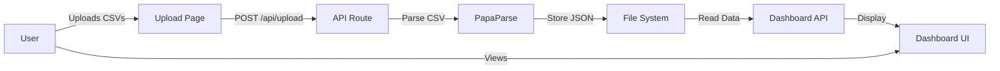

# System Architecture

## Overview
Simple Next.js 14 application for personal profitability tracking, deployed on Vercel.

## Tech Stack

### Frontend
- **Framework**: Next.js 14 (App Router)
- **UI Library**: Radix UI Themes
- **Styling**: Tailwind CSS
- **Charts**: Recharts
- **Icons**: Lucide React
- **File Upload**: react-dropzone
- **CSV Parsing**: PapaParse

### Backend
- **Runtime**: Node.js
- **API**: Next.js Route Handlers
- **Storage**: File system (JSON)
- **Auth**: Hardcoded credentials (personal use)

### Infrastructure
- **Hosting**: Vercel
- **URL**: https://am-copilot.vercel.app
- **Deployment**: Git push to main branch
- **Environment**: Single production instance

## Application Structure

```
/
├── app/                    # Next.js 14 App Directory
│   ├── page.tsx           # Main dashboard
│   ├── upload/            # CSV upload page
│   ├── dashboard/         # Profitability view
│   ├── api/               # API routes
│   │   ├── auth/          # Login endpoints
│   │   ├── upload/        # CSV processing
│   │   └── dashboard/     # Data retrieval
│   └── layout.tsx         # Root layout
├── src/
│   ├── services/          # API service layer
│   └── middleware/        # Auth middleware
├── data/                  # JSON file storage
└── public/                # Static assets
```

## Data Flow



## Component Architecture

### Pages
1. **/** - Main dashboard with complex charts
2. **/upload** - Drag-and-drop CSV interface
3. **/dashboard** - Simple profitability table

### API Routes
1. **/api/auth/login** - Session-based auth
2. **/api/upload** - CSV processing & storage
3. **/api/dashboard** - Data retrieval

### Key Components
- `MetricCard` - KPI display cards
- `ExceptionAlert` - Warning notifications
- `HarvestSummary` - Time tracking overview

## Authentication Flow

```javascript
// Hardcoded for personal use
username: 'joe'
password: 'demo2025'
session: JWT with 8-hour expiry
```

## Data Storage

### File Structure
```
data/
├── hubspot_2025-09-22.json
├── finance_2025-09-22.json
└── latest.json              # Combined current data
```

### JSON Schema
```typescript
{
  timestamp: string,
  hubspot: {
    name: string,
    data: Array<{
      [column]: any
    }>
  },
  finance: {
    name: string,
    data: Array<{
      [column]: any
    }>
  }
}
```

## Security Model

### Production (Minimal Security - Personal Tool)
- Hardcoded credentials in code
- Public GitHub repository
- No sensitive data in CSVs
- Vercel deployment protection only

### Acceptable Because
- Single user (Joe)
- Non-sensitive data
- Internal use only
- Boss has read-only access via URL

## Performance Characteristics

### Strengths
- Fast deployment (< 1 min)
- Simple codebase
- Minimal dependencies
- Quick page loads
- No database overhead

### Limitations
- No concurrent users
- File system storage limits
- No caching layer
- Manual data refresh
- No background processing

## Deployment Pipeline

1. **Local Development**
   ```bash
   npm run dev
   ```

2. **Git Commit**
   ```bash
   git add -A
   git commit -m "message"
   git push
   ```

3. **Vercel Auto-Deploy**
   - Triggered on push to main
   - Build and deploy in ~1 minute
   - URL: am-copilot.vercel.app

## Error Handling

### User Errors
- Invalid CSV format → Error message
- Missing columns → Uses defaults
- Auth failure → Fallback credentials

### System Errors
- File write fails → 500 error
- Parse errors → Empty data returned
- Network issues → Retry manually

## Monitoring

### Current State
- No formal monitoring
- Vercel dashboard for deploys
- Manual testing weekly
- Browser console for debugging

### Not Needed
- APM tools
- Error tracking (beyond Sentry setup)
- Analytics
- Logging infrastructure

## Scaling Considerations

### Current Limits
- 1 user
- Weekly uploads
- ~10-50 clients
- Simple calculations

### If Needed (Not Planned)
- Move to database
- Add caching
- Implement queues
- Add user management

## Maintenance

### Weekly
- Upload new CSVs
- Verify calculations
- Check deployment

### Monthly
- Review client mappings
- Clear old data files
- Update documentation

### As Needed
- Fix column mappings
- Adjust calculations
- Update UI

## Design Decisions

### Why Next.js 14?
- Modern React patterns
- Built-in API routes
- Vercel integration
- App Router benefits

### Why File Storage?
- Simplest possible solution
- No database setup
- Easy debugging
- Portable data

### Why Hardcoded Auth?
- Single user
- No user management needed
- Fastest implementation
- Zero configuration

### Why Manual CSV?
- Full control over timing
- No API dependencies
- Simple process
- Easy troubleshooting

## Alternative Considered (Simon Willison Approach)

Per SIMON_WILLISON_APPROACH.md, we considered:
- SQLite database
- More automation
- Better querying

Rejected because:
- Overkill for weekly uploads
- Added complexity
- Current solution works fine
- YAGNI principle

## Summary

Architecture optimized for:
1. **Simplicity** over scalability
2. **Speed** of development over robustness
3. **Personal use** over multi-tenant
4. **Manual control** over automation
5. **Pragmatism** over perfection

Perfect for a personal tool that needs to work reliably once a week.